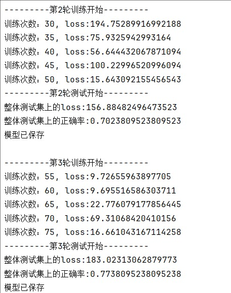

# 实验过程

```python
#					目录
# 数据预处理
# 模型构建
# 模型训练
# 模型评估（可视化展示）
```


## 数据预处理

```python
	# 导入数据集并做缺失项的删除
    data_path = "data/train.csv"
    df = pd.read_csv(data_path)
    df = df.iloc[:, 1::]                                # 去除第一列ID项
    b = np.sum(df.isnull(), axis = 1) == 0              # 每一行中缺失数据的个数为零的bool数组，即有效的数据
    df_without_null = df[b]                             # 有效的数据，用pandas对象表示

    # 在数据标准化、归一化之前，把标签（最后的答案）分离出来
    data_without_null = df_without_null.iloc[:, 0:-1:]
    lables_without_null = df_without_null.iloc[:, -1]

    # 数据的标准化、归一化
    scaler = StandardScaler()
    data_standerlized = scaler.fit_transform(data_without_null)
    # 此步骤之后data_standerlized是numpy数组，但是labels是Series对象，需要统一为numpy才能切分train和test数据集
    # 统一labels和data的数据类型为numpy类型
    data_numpy = data_standerlized
    labels_numpy = lables_without_null.values
```


## 模型构建

```python
# 构建一个用于dataloader的数据集dataset（Dataset.py文件中）
import torch
from torch.utils.data import Dataset


class MyDataset(Dataset):
    def __init__(self, data: torch.Tensor, labels: torch.Tensor):
        super().__init__()
        self.data = data
        self.labels = labels

    def __len__(self):
        return len(self.data)

    def __getitem__(self, index):
        data = self.data[index]
        label = self.labels[index]
        return data, label

# 构建用于训练的神经网络模型（ModelClass.py文件中）
import torch
import torch.nn as nn


class MyModel1(nn.Module):
    def __init__(self, inplace):
        # tain_data的数据是13列
        # 这里的inplace是指Relu激活函数中的参数
        super().__init__()
        self.my_model1 = nn.Sequential(
            nn.Linear(13, 64),
            # nn.Dropout1d(p=0.5, inplace=False),
            nn.ReLU(inplace),
            nn.Linear(64, 32),
            # nn.Dropout1d(p=0.5, inplace=False),
            nn.ReLU(inplace),
            nn.Linear(32, 8),
            # nn.Dropout1d(p=0.5, inplace=False),
            nn.ReLU(inplace),
            nn.Linear(8, 1),
        )

    def forward(self, data):
        data = data.to(torch.float32)
        return self.my_model1(data)

# 神经网络的导入，优化器、损失函数的设置
 	# 将数据集切分为训练集和测试集
    (data_train,
     data_test,
     labels_train,
     labels_test) = train_test_split(data_numpy, labels_numpy, test_size=0.25)

    # 将数据转化为tensor格式(指定为torch.float32类型，与神经网络中的参数匹配)
    data_train_tensor = torch.tensor(data_train).to(torch.float32)
    data_test_tensor = torch.tensor(data_test).to(torch.float32)
    labels_train_tensor = torch.tensor(labels_train).to(torch.float32)
    labels_test_tensor = torch.tensor(labels_test).to(torch.float32)

    # 导入设计好的网络模型
    model = ModelClass.MyModel1(inplace=True)
    # 交叉熵损失函数适用于分类任务，target的值通常是整数，不适用于回归任务（采用nn.MSELoss()）
    # loss = nn.CrossEntropyLoss()
    loss = nn.MSELoss()
    optimizer = torch.optim.SGD(model.parameters(), lr=learning_rate)
    total_train_step = 0
    total_test_step = 0

    # 实现自定义数据集和数据集的随机抽取（dataset与dataloader）
    data_train_dataset = MyDataset(data_train_tensor, labels_train_tensor)
    data_test_dataset = MyDataset(data_test_tensor, labels_test_tensor)
    train_dataloader = DataLoader(data_train_dataset, batch_size = batch_size)
    test_dataloader = DataLoader(data_test_dataset, batch_size = batch_size)
    train_data_size = len(data_train_tensor)
    test_data_size = len(data_test_tensor)
```


## 模型训练

使用`tensorboard`进行损失函数的展示，通过设置`epoch`、`learningrate`、`batchsize`等超参数进行模型的调整

分为训练集和测试集，先在训练集上进行对dataset的一整个遍历，然后进入一次测试集，总共进行epoch这么多轮，中途保存每一次epoch完成之后的模型参数到指定位置。中途每5个epoch展示一次train的loss值，以及每次epoch结束之后的测试集合上的正确率

```python
	# 正式开始训练模型
    # 准备tensorboard
    result_dir = "lab_result"
    result_path = os.path.join(result_dir, "model_test", model_name, experiment_label)
    writer = SummaryWriter(log_dir=result_path)

    # 准备训练和测试
    for i in range(epoch):
        print("---------第{}轮训练开始---------".format(i + 1))

        # 训练步骤开始
        model.train()
        for data in train_dataloader:
            data_parameter, labels = data
            outputs = model(data_parameter)
            outputs = outputs.squeeze(-1)   # 否则报warning:UserWarning: Using a target size (torch.Size([64])) that is different to the input size (torch.Size([64, 1])). This will likely lead to incorrect results due to broadcasting. Please ensure they have the same size. return F.mse_loss(input, target, reduction=self.reduction)
            result_loss = loss(outputs, labels)

            # 优化器与优化
            optimizer.zero_grad()
            result_loss.backward()
            optimizer.step()

            total_train_step += 1
            if total_train_step % 5 == 0:
                print("训练次数：{}, loss:{}".format(total_train_step, result_loss.item()))
                writer.add_scalar("train_loss", result_loss.item(), total_train_step)

        # 测试步骤开始
        print("---------第{}轮测试开始---------".format(i + 1))
        model.eval()
        total_test_loss = 0
        total_test_accuracy = 0
        with torch.no_grad():
            time = 0    # 用来记录下面这个循环执行了多少次，方便计算最后的loss值
            for data in test_dataloader:
                data_parameter, labels = data
                outputs = model(data_parameter)
                result_loss = loss(outputs, labels)
                total_test_loss += result_loss.item()
                # 认为预测值和真实值之间的差距的绝对值不超过allowed_error_range就为正确
                total_test_accuracy += (torch.abs(outputs.T - labels) <= allowed_error_range).sum()
                total_test_step += 1
                time += 1

        total_test_loss = total_test_loss / time
        total_test_accuracy = total_test_accuracy.__float__()
        total_test_accuracy /= test_data_size
        print("整体测试集上的loss:{}".format(total_test_loss))
        print("整体测试集上的正确率:{}".format(total_test_accuracy))
        writer.add_scalar("test_loss", total_test_loss, i)
        writer.add_scalar("test_accuracy", total_test_accuracy, i)

        model_dir = "model_files"
        model_epoch = "epoch_{}_test_accuracy{}.pth".format(i, total_test_accuracy)
        model_folder = os.path.join(model_dir, model_name, experiment_label)
        model_path = os.path.join(model_folder, model_epoch)
        if not os.path.exists(model_folder):
            os.makedirs(model_folder)
        torch.save(model, model_path)
        print("模型已保存\n")

    writer.close()
```


## 模型评估（可视化展示）

<p align="center">
    <span></span><br>
    
    <br>
    <span></span><br>
    
    
    <br>
    <span></span><br>
    <br>
</p>


# 结果分析与改进

训练的过程中，测试集与训练集的结果存在比较明显的差异，模型的训练出现了过拟合现象，到模型训练的最后训练集的损失函数值已经小于1，但是模型的测试集中损失函数值仍为两百多。同时测试集中途出现了比较好的正确率（误差在5以内认为是正确），但之后又出现明显下滑，表明模型出现了过拟合，需要及早停止训练。

可以采用添加dropout层来减弱过拟合的风险，通过早停法，在模型训练的过程中，及时停止或者保存训练效果最好的一次，进行后续分析。