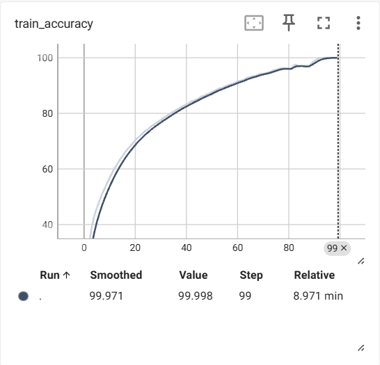
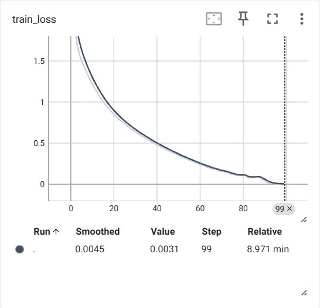
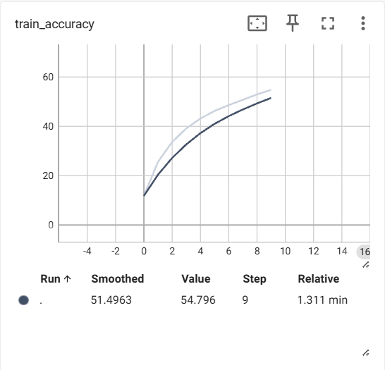
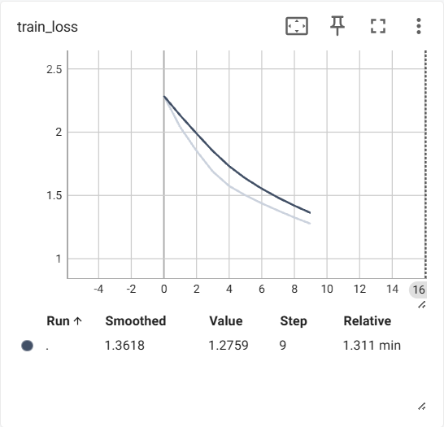
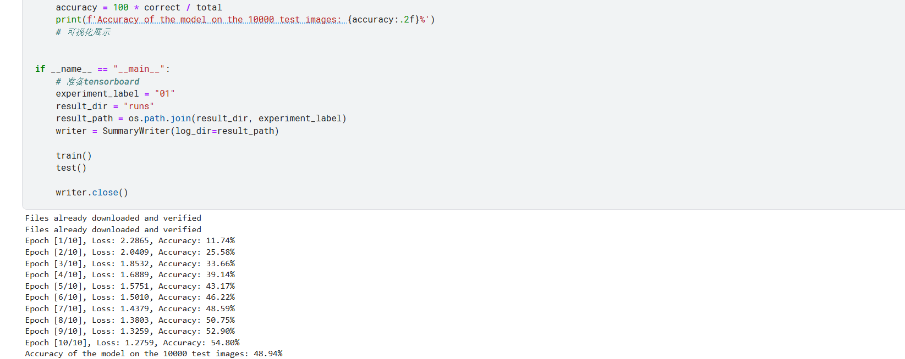

# 实现思路

代码需要补全的主要是模型的网络结构，损失函数、优化器、模型的定义和`epoch`、`learing_rate`等超参数的设置，所以操作的重点主要在模型的网络结构上：

## 模型的网络结构定义

CIFAR_10数据集的图片的大小是`32*32*3`的大小，最终需要的到的是一个长度为10的向量，这10个数据分别对应CIFAR_10中的10中类别的预测概率，从此完成分类任务。

模型需要采用的神经网络层选择的是卷积神经网路`Conv2d`、激活函数（`Relu`）、池化层（`MaxPool2d`）（用于压缩参数矩阵，提取特征）、将二维tensor转化为一维向量的`Flatten`网络和最后将输出值变为10个类别对应概率的`Linear`层

在定义神经网络的时候还有一些参数需要考虑，如Conv2d中的padding参数，卷积核大小的参数

## 神经网络对象类的定义

-   网络的结构通过`nn.Sequential()`函数，统一定义需要的神经网络层
-   网络的结构作为self的属性，在初始化类的函数中定义
-   定义forward方法，方便`__call__`方法的调用，进行前向传播

```python
class Network(nn.Module):
    def __init__(self):
        super(Network, self).__init__()
        # TODO:这里补全你的网络层
        self.my_model1 = nn.Sequential(
            nn.Conv2d(3, 32, 5, padding=2),
            nn.MaxPool2d(2),
            nn.ReLU(True),
            nn.Conv2d(32, 32, 5, padding=2),
            nn.MaxPool2d(2),
            nn.ReLU(True),
            nn.Conv2d(32, 64, 5, padding=2),
            nn.MaxPool2d(2),
            nn.ReLU(True),
            nn.Flatten(),
            nn.Linear(1024, 64),
            nn.Linear(64, 10)
        )

    def forward(self, x):
        # TODO:这里补全你的前向传播
        img = self.my_model1(x)
        return img

```


# 实验结果、分析及改进措施

-   epoch=100的时候的实验结果

    <p align="center">
        <span>模型出现了过拟合现象，在训练集上准确率已经达到了100%,在测试集上的训练结果准确率为70%，差异较大，原因可能为epoch过大，训练轮数过多，导致在train集上过度学习，过渡拟合</span><br>
        
        <br>
        <span></span><br>
        
    </p>

-   epoch=10的时候的实验结果

    <p align="center">
        <span>模型出现了欠拟合现象，可能为epoch过小，训练轮数过少，学习的特征不够多，应该适当增加学习轮数</span><br>
        
        <br>
        <span></span><br>
        
    </p>

