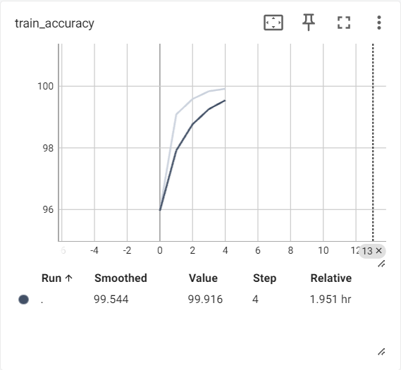

# VIT论文笔记

## 论文的结论和意义

作者指出，在计算机视觉中，尽管卷积神经网络（CNN）占主导地位，但在自然语言处理（NLP）任务中非常成功的Transformer也能够在CV领域有很好的效果。

论文同一系列对比试验证明了纯Transformer架构可以在图像分类任务上表现良好，并且具备更短的训练时间（相对于现有的神经网络模型来说），以及在大规模数据集上，能有优于传统CNN网络的结果。

## 论文的关键点

将用于transformer结构用于计算机视觉，通过把图片切分为不同的patch，然后将patch拉直变为一个一个的向量，就转化为了transformer能处理的向量信息。

论文中的模型还引入了位置编号等向量，帮助模型学习图片之间的相对位置关系

## VIT和CNN的异同点

-   相同点
    -   VIT和CNN都需要大规模数据的训练，才能获得较高的准确率
    -   两者都需要对图像数据进行分块的处理，只不过VIT是通过切分成不同的patch，CNN是通过卷积核的感受野实现的
-   不同点
    -   VIT使用的是一个纯粹的transformer模型，与CNN的卷积神经网络构造有根本的区别
    -   VIT由于自注意力机制等transformer的特性，更容易学习到图片相距更远的数据之间的关联信息，CNN更容易由于是依靠卷积核的滑动不断提取信息，只能学习到感受野的信息，然后再通过一层一层的网络叠加，逐渐得到更远距离的数据的相互关系。所以，VIT在不同位置的数据之间的相互关系的学习上，比CNN更远。
    -   卷积操作的计算复杂度相对较低，尤其是在处理高分辨率图像时，可以通过池化等操作降低计算量。自注意力机制的计算复杂度与图像大小的平方成正比，因此在处理高分辨率图像时计算量较大。
    -   从试验的结果来看，在小数据集的训练上，CNN效果更好，VIT效果更差，在超大数据集上，VIT的效果更好

## 架构分析

VIT 模型主要由三个部分组成：图像预处理、Transformer 编码器和分类头。

1.  图像预处理：将输入图像分割成固定大小的 patches，然后通过线性映射将每个 patch 转换为向量，并加上位置编码。
2.  transformer 编码器：由多个相同的层组成，每个层包含多头自注意力机制和前馈神经网络。
3.  分类头：通常是一个简单的全连接层，用于对 transformer 编码器输出的特征进行分类。

# 相关对比试验与结果分析

## VIT与传统神经网络VGG的训练对比

试验采用的都是利用`timm`库搭建的模型，由于VIT模型在小规模数据集上训练效果并不好，所以这里直接都采用与训练好的参数，进行迁移学习，统一学习5个epoch，每个epoch遍历CIFAR_10数据集的训练集和测试集各一次，下面的训练结果是在测试集的准确率，测试集占总数据集的$$\frac{1}{4}$$

VIT采用vit_base_patch16_224模型（采用预训练的参数，进行微调）

VNN采用vgg16模型（采用预训练的参数，进行微调）

下面是VIT模型在5个epoch上，测试集和训练集上准确率训练结（实线部分）

    
    

下面是VGG模型在5个epoch的训练数据

    
    

可以看到，VIT模型明显比VGG模型的准确律更高，并且两者都还没有出现饱和的情况，这样的结果可能是因为5个epoch对于VGG模型参数的调整和学习来说可能时间太短，不过从另一个角度，也契合了论文中关于大规模训练数据上训练的VIT模型比传统CNN网络准确率更高的结论

## VIT中不同patch size对结果的影响

这里由于`timm`库中，能找到的VIT_base模型的patch size只有`16*16`和`32*32`两种规格，其他例如vit_small更少，而vit的参数更大的模型训练时间太长，试验没有选择这样的模型

### 训练时间的不同

VIT_base模型采用`32*32`的patch size。时间明显比`16*16`的模型快很多，大概32大小的模型训练5个epoch用了不到40分钟，但是16大小的模型训练5个epoch用了3个多小时（训练使用的是`kaggle`平台提供的$$P100 \times 2$$）。这里由于训练时没有设置记录时间的参数，所以不能展示

原因可能是，更大的patch size使得transformer需要处理的patch数量减少，模型需要处理的输入向量更短，而在自注意力计算中，其计算复杂度与序列长度的平方成正比，因此当模型从$$16 \times 16$$的patch size变化为$$32 \times 32$$的patch size时，时间显著缩短。

### 训练准确率的不同

一下是两者在test集上的训练准确率，每隔一个Epoch就在test集上测试一次（下图中epoch=1时，位于上侧的是patch size =32的模型）（当时因为写plot的线条形状的时候，都写成了'r--'，忘了改，导致两个直接看图没法区分，下次真不能犯这样的错误了:cry:）

在CIFAR_10数据集上，似乎$$32\times 32$$的patch size具有更高的准确率，通常情况下，patch size越小，处理细节的能力越强，对细小区别的学习能力更强，相反，更大的patch size 在需要综合全局来进行图片区分的任务相对而言更具优势，这里试验结果的可能原因是：CIFAR_10数据集中目标的类别差距较大，对细节处理的能力要求不高，更有利于patch更大的模型

值得注意的是，最后两条曲线几乎趋于一致，说明即便patch size更小，仍然具备对全局数据的处理能力，在经过参数更新和学习之后，仍然能调整自己的效果

总结：更准确的结论应该在更多不同特征的数据集测试才能得出，例如，在类别更接近的类别中进行测试（麻雀和金丝雀等）

