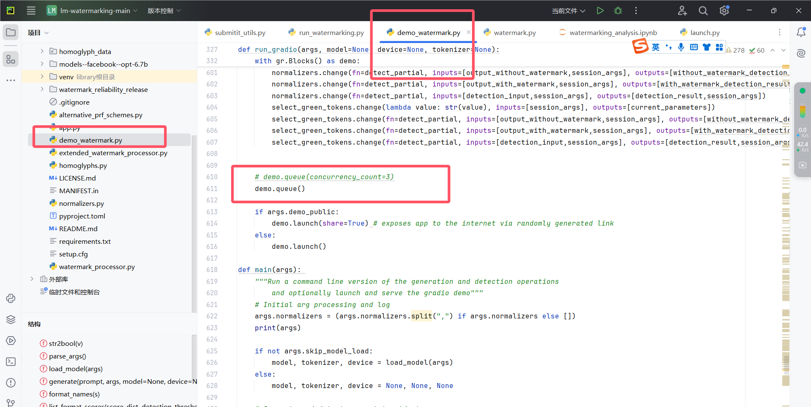

# 论文阅读

## 论文的主要思想

通过在模型预测输入序列prompt的下一个单词的时候，将候选单词分成green和red两部分（单词区分的方式是将prompt的最后一个单词的token序列通过hash函数映射后作为随即种子，按照超参数γ确定的比例区分绿色和红色），然后通过soft marking 或者hard marking的方法，让模型倾向于或者只能选择绿色单词作为生成结果。最后通过统计文本中绿色和红色token的占比与正态分布中预期值的大小关系（与γ有关）,判断文本数据是机器生成还是人工书写。

## 相关难点

### 底墒文本的水印识别

底墒文本复杂度低，文本短，在一些固定句式和俗语上表现尤为突出，在例如`for(int i = 0)`这样的句子里，机器生成的文本通常和人写的文本没什么差别

处理的方法即下面的水印添加方法hard marking 和 soft marking：

当 green token 比例 𝛾 很小且 green bias 𝛿 很大时，即便超短文本也可以嵌入很强的水印。

## 水印添加方法

### hard marking

大体与论文主要思想中一致，关键点是，强硬要求模型生成的时候必须选择标记为绿色的token，如果概率最高的token是红色标记，那就放弃这个token，继续看概率最高的token，直到他是绿色标记位置，然后选择。

### soft marking

与hard marking 基本一致，不同点在于不强硬要求模型选择绿色的token，而是通过给绿色token的候选token的logits加一个正的偏置参数$$\delta$$，从而拔高了绿色token被选择的比例，同时也一定程度上降低了因为添加水印而导致模型生成质量下降的问题（因为如果red token概率第一，并且与green token概率差距非常大，即便logits加了$$\delta$$，红色的token仍然是最合适的候选项）

## 对比试验与超参数的影响

### 水印强度对文本质量的影响

由试验结果可见

γ越小，在实验做的取值范围内，水印强度更小，文本质量越高

在不同的超参数组合下，水印强度与文本质量呈现负相关趋势

### beam search算法对水印强度在文本质量上负影响的改善

可以发现，随着Beam 的数量增大，即便$$\delta$$增大，文本质量下降的幅度越来越小，到了Beam数量为8的时候，文本质量几乎不随水印强度的增大而改变了。

### 水印强度与Token数量的关系

从 a, b 图来看，token越多，水印强度越大，也即文本数据越长，越容易区分机器和人。同时更小的 green list 以及更大的 green bias 也导致 z-score 更大。

c 图展示 8-way Beam Search 下的试验效果，与b图进行对比，水印强度在各个参数下的值都更大。其中$$\delta=2.0$$的时候，水印强度已经和$$\delta=10.0$$的时候几乎一致，引入beam search，特别是当beam的数量为8的时候，既保证了文本质量，有提高了水印强度，协同关系非常明显。

## 可能的攻击方式

1.  文本插入攻击

    在生成的文本后添加可能在红色列表中的 token，这可能会改变下游 token 的红色列表计算。新添加的 token 可能会打乱原始水印算法中基于先前 token 计算红色列表的逻辑，使得检测时绿色列表 token 比例发生变化，影响 z 统计量，从而可能逃避检测。

2.  文本删除攻击

    从生成的文本中删除 token，可能会移除绿色列表中的 token 并修改下游红色列表。删除操作改变了文本的结构和 token 的顺序，影响了绿色列表 token 的分布，可能导致绿色列表 token 数量减少，z 统计量降低，使水印难以检测。

3.  文本替换攻击

    将一个 token 替换为另一个，可能引入红色列表 token 并导致下游红色列表变化。替换操作直接改变了 token 的内容，可能破坏了水印算法中对绿色列表和红色列表的设置，影响绿色列表 token 的统计，使水印检测失效。

# 论文复现

没有完成，我用的用作者代码仓库中的代码进行复现，主要是遇到了如下的问题：

-   如果采用作者推荐的最新版本的（非原论文发表的时候使用的代码（即experiment文件夹的内容））找不到怎么固定FPR的取值为1%，并且也没有说用什么dataset，对整个项目进行搜索之后都没有找到，没找到dataset，自然没办法运行多次水印添加和文本生成，更别谈计算fpr和npr这些大规模测试之后的结果了，所以后面计算各个处理结果的参数都没能进行。
-   如果采用原论文发表的时候的代码（即experiment中的代码）确实有加载什么dataset，也有计算FPR等数值的函数，但是用的是c4，然后下载一个c4数据集要350G,我电脑好像没有一个盘能装的下来，就也没干成
-   然后就是experiment中的notebook，但是我的pycharm不是专业版，运行不了:cry:

本人就只跑通了作者推荐的额最新的代码，下面是遇到的问题和最终的结果展示

-   C盘空间不够，更改hugging face的下载目录

    https://blog.csdn.net/yuezhilanyi/article/details/130320801

-   下载模型之后，代码死活找不到文件，尽管路径好像是对的

    

这是下载的模型

然后我尝试直接把模型放到项目目录下，修改查询模型的地址，结果还是找不到文件，报错

最后我是用另外的渠道下载了另外一个模型，即facebook_opt_1.3b，然后才能过了模型参数这一关

-   然后遇到了新的问题，代码中的控制并行量的参数那行代码老是报错，过不了，这里忘了截图了，我是直接把这个参数给删了，然后才跑通，可能是设备太低端，搞不了并行计算？

    

-   最后是成功运行gradio交互界面的代码，但是并不是论文复现中对数据库中大量数据进行测试的代码。

    

    

# 自己认为的缺陷

-   这个水印加不加完全取决于模型自己最后要不要加水印，那如果信息发布者就是不想加水印，我怎么知道这个发布出来的消息是人写的还是机器写的？

-   如果我在模型训练的时候，知道了检测水印的机制，知道了最终结果的概率分布，就训练模型尽量让输出结果红色token和绿色token的比例尽量预期概率，那么这个水印方法是否就没有效果了？

    

